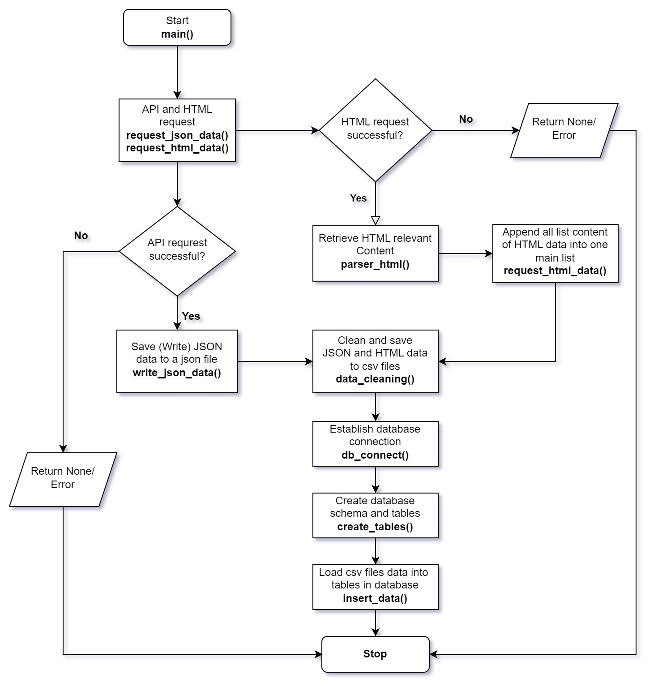

## Project Title - Building ETL Data Pipeline for Laptop data at AliExpress website
  ### Author - Benjamin Yankey 
  
  ### Project Description: 
  Embark on a challenging journey with this project, where I was tasked to tackle the extraction of a substantial and diverse dataset from the AliExpress website and its API. The primary focus revolves around addressing complexities, variabilities, and ethical considerations associated with efficient and accurate data scraping. Furthermore, I aim to transform the extracted data into a structured format conducive to thorough analysis. The core objective is the development of a reliable, scalable pipeline that supports routine data updates and maintenance. 
  Key tasks include 
  - scraping data without disrupting the website's operations.
  - cleaning and normalizing extracted data for quality assurance.
  - transforming data into optimized tables for enhanced query performance and integrity.
  - loading the refined data into a PostgreSQL database, ensuring adherence to data security and governance standards.
  This project aims to create a scalable and maintainable system capable of accommodating future changes in data sources and structures.

### Project Workflow Chart
  

### Project Entity Relationship Diagram Chart
  

### Project Tools and Technologies
  - ### Data Extraction:
    *  Python libraries
       * Requests for sending and receiving  HTTP requests. 
       * BeautifulSoup for web scrapping to extract data from the AliExpress website and its API
  - ### Data Cleaning and Transformation:
    * Python library - Pandas for cleaning and transforming data into csv files.
  
  - ### Data Loading and storage:
    * Postgresql to receive and store structured data.
    * SQL for data manipulation, transformation, and querying within the PostgreSQL environment.
      
  - ### Maintenance and Scaling
    * Normalization technique used in creating tables in database to ensure scalability of databse.
      
  - ### Documentation of the entire process for future reference and modification.
    * README.md file
    * Employed code comments to explain complex logic, transformations, or any parts of the code that might not be immediately obvious
    * Employed logging to capture important events, errors, and information during the pipeline execution.
    * The use of git version control maintaining clear commit messages to track changes and improvements.
    
  - ### Data Sources:
    * AliExpress API and AliExpress website, which provide a rich source of e-commerce data.
### Project Challenges
  - Error Handling and Logging: I encounted diverse error types such as data inconsistencies and format discrepancies.
  - Handling Schema Changes: Changes in source data schemas or unexpected changes in data formats can result in errors during the ETL process.
  - Testing: This was time consumming as I had to test individual components of the ETL process, such as functions or methods responsible for extraction, transformation, and loading.
### Project Recommendation
    - 

